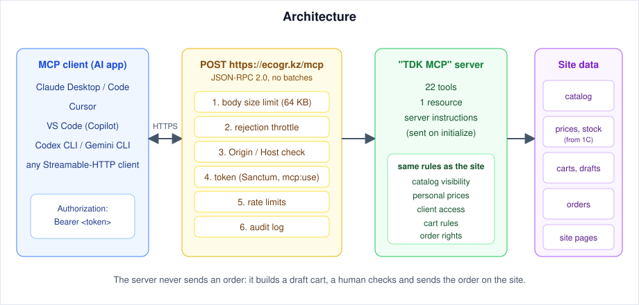
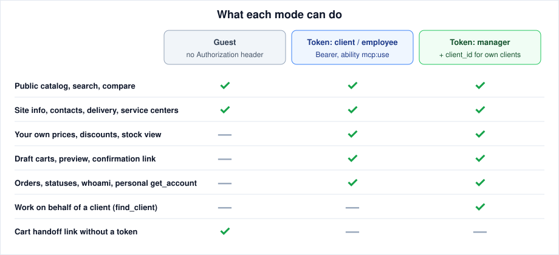
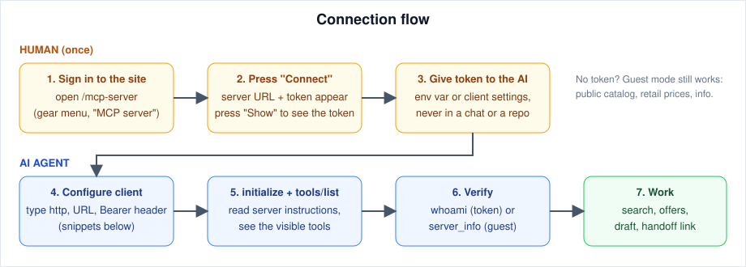
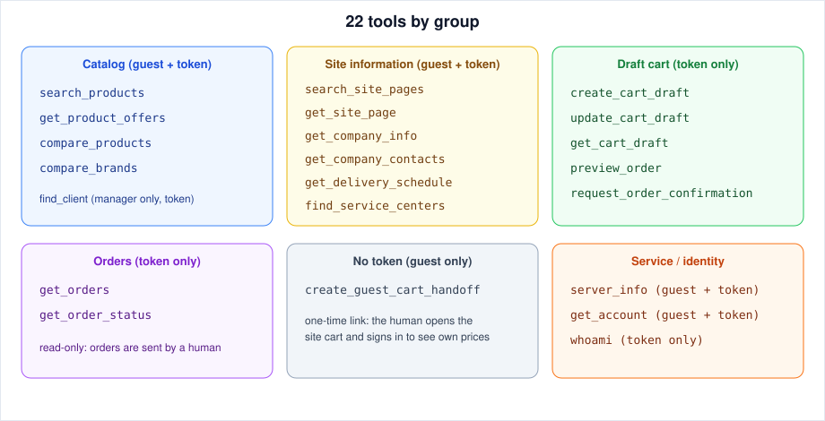
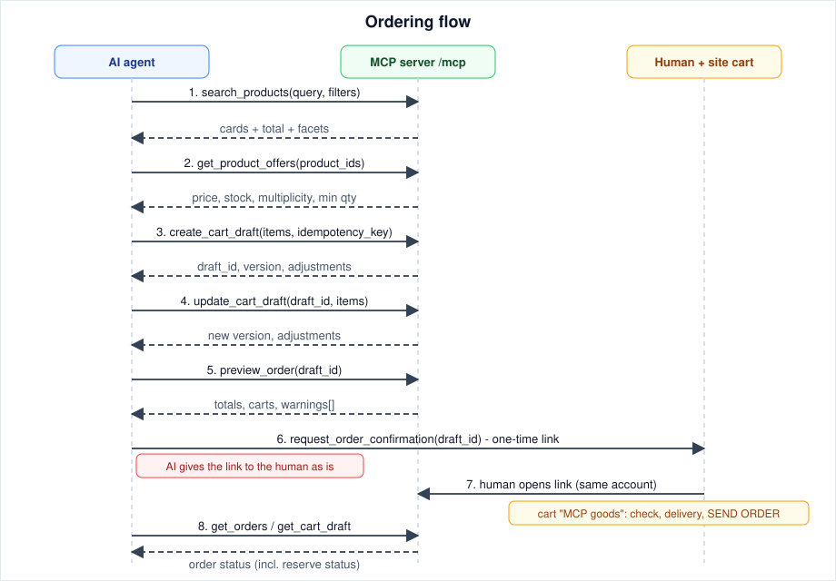

# ecogr.kz MCP server

**English** · [Русский](#ru) · [Қазақша](#kk)

<a id="en"></a>

> **For AI agents reading this file:** this README is written so that you can connect to the server, configure your own client and work with it without further help. Start with [section 0](#en-0). Everything you need (URL, headers, tool names, argument rules, limits, error handling) is in this file. Sections marked **MUST** are hard rules.

| | |
|---|---|
| Server name | `TDK MCP` (version in `server_info`) |
| Endpoint | `https://ecogr.kz/mcp` |
| Transport | MCP Streamable HTTP, `POST`, JSON-RPC 2.0 (no batches), stateless |
| Auth | `Authorization: Bearer <token>` (Laravel Sanctum token with ability `mcp:use`); no header = guest |
| OAuth / dynamic client registration | **not supported** (use the bearer token) |
| Tools | 22 (read-only, except draft-cart tools; the server never submits an order) |
| Languages of data | texts of the site (Russian), error messages and tool contracts (English) |

---

## <a id="en-0"></a>0. AI quick start (decision procedure)

Follow these steps in order. Stop at the first step that fails and use [Troubleshooting](#en-10).

1. **Check reachability as a guest** (no secrets needed):
   ```bash
   curl -sS https://ecogr.kz/mcp \
     -H "Content-Type: application/json" \
     -H "Accept: application/json, text/event-stream" \
     -d '{"jsonrpc":"2.0","id":1,"method":"tools/call","params":{"name":"server_info","arguments":{}}}'
   ```
   Expected: HTTP 200 and JSON with `result` (server name, version, URL, server time). If you were given another base URL (staging, local), use it instead and keep it everywhere below.
2. **Decide the mode.** Guest mode is enough for catalog search, retail prices, comparisons and company information. You need a **token** for personal prices, stock as the user sees it, draft carts, orders and working on behalf of a client. See [Access modes](#en-3).
3. **Ask the human for a token — you cannot create one yourself.** Tell them: sign in to the site, open `https://ecogr.kz/mcp-server` (gear menu next to the name, "MCP server"), press **Connect**, press **Show**, copy the token and put it into an environment variable `ECOGR_MCP_TOKEN` (or into the client settings). Never ask them to paste the token into a chat, an issue, a commit or a log if there is any other way.
4. **Configure your MCP client** with the snippet for your client from [section 4.3](#en-4). Requirements the server imposes: URL `https://ecogr.kz/mcp`, transport "http" (Streamable HTTP), header `Authorization: Bearer <token>`.
5. **Verify.** With a token call `whoami`; as a guest call `server_info`. `whoami` returns user id, roles and token abilities (must contain `mcp:use`).
6. **Read the server instructions.** They arrive in the `initialize` result (`instructions`). They repeat the rules of [section 7](#en-7) and are always the newest version, so prefer them when they differ from this file.
7. **Work** using the [workflows](#en-6). If a tool you expect is missing from `tools/list`, you lack access (for example a guest has no `create_cart_draft`); calling it by name returns the reason ("needs a token").

---

## 1. What it is

An MCP (Model Context Protocol) server of the ecogr.kz trade site. An AI application connected to it can:

- search the catalog, show product cards with prices, discounts, stock by warehouse, multiplicity and minimum quantity, warranty, characteristics, photos, analogs and compatible goods;
- compare 2–5 products by characteristics and 2–5 brands by facts;
- answer questions about the company, offices, delivery schedule, service centers and published site pages (news, promotions, instructions);
- build a **draft cart**, calculate how the site would split and price the order, and hand it to the human through a one-time link;
- show the user's orders and their statuses (including the reserve status);
- let a **manager** do all that on behalf of own clients.

**The user gets exactly what they see on the site in a browser** under their account: same goods, prices, discounts, stock and orders. There are no separate permissions for MCP.

**The server never submits an order or a reserve.** It returns a link; the human opens the site cart, checks the contents, chooses delivery and sends the order.

## 2. Architecture



Every request passes six gates in this order: body size limit, rejection throttle, `Origin`/`Host` check, token check, rate limits, audit log. Business rules (catalog visibility, personal prices, client access, cart rules) are the site's own rules.

## <a id="en-3"></a>3. Access modes



| Mode | How | Can do |
|---|---|---|
| **Guest** | no `Authorization` header | public catalog, retail prices, comparisons, site pages, company info, delivery, service centers, `create_guest_cart_handoff` |
| **Token** | `Authorization: Bearer <token>` | everything for the token owner: personal prices and discounts, stock as shown to this user, draft carts, orders, `get_account`, `whoami` |
| **Token of a manager** | same, plus `client_id` | the same for the manager's own clients (`find_client` → `client_id`); the `client_id` parameter appears in tool schemas **only** for managers |

Important details:

- A **missing** header means guest. A **presented but invalid** token is rejected with HTTP 401 and is never silently downgraded to guest.
- Who can get a token: clients and employees (roles `User`, `Guest` and `Blocked` cannot). A blocked account is rejected with 403 `account_blocked`.
- A token has exactly one ability, `mcp:use`. An ordinary site API token, even with `*`, **does not** work for MCP (403 `insufficient_scope`).
- The set of tools in `tools/list` depends on access: tools you cannot use are hidden, and `client_id` is shown only if you may act for clients.

## <a id="en-4"></a>4. Connect



### 4.1 Get the token (human, once)

1. Sign in to the site and open `https://ecogr.kz/mcp-server` (gear menu → "MCP server"; in the mobile version the gear is in the bottom bar).
2. Press **Connect**. The server address and a token appear. Press **Show** to see it in full.
3. Under the token the page shows a ready JSON snippet; many clients accept it as is.
4. **Reissue** creates a new token (the old one stops working immediately). **Disconnect** deletes the token. A token unused for a configured number of days is deleted automatically; then press **Connect** again.

If the page says that connecting is unavailable, the account has no role that allows it: contact the manager.

### 4.2 Required connection parameters

```
URL:       https://ecogr.kz/mcp
Transport: http  (MCP Streamable HTTP)
Header:    Authorization: Bearer <token>        (omit entirely for guest mode)
```

### 4.3 Client snippets

Keep the token in an environment variable where the client allows it. Formats of clients change over time: if a snippet fails, apply the three parameters above using the client's own documentation.

**Generic JSON** (what the site page shows; used by Cursor, Windsurf, many others):

```json
{
  "mcpServers": {
    "ecogr-kz": {
      "type": "http",
      "url": "https://ecogr.kz/mcp",
      "headers": { "Authorization": "Bearer YOUR_TOKEN" }
    }
  }
}
```

**Claude Code:**

```bash
claude mcp add --transport http --scope user ecogr-kz https://ecogr.kz/mcp \
  --header "Authorization: Bearer $ECOGR_MCP_TOKEN"
claude mcp list
```
Guest mode: the same command without `--header`.

**Claude Desktop** (`claude_desktop_config.json` starts local processes, so use the `mcp-remote` bridge; requires Node.js):

```json
{
  "mcpServers": {
    "ecogr-kz": {
      "command": "npx",
      "args": ["-y", "mcp-remote", "https://ecogr.kz/mcp", "--header", "Authorization:${AUTH_HEADER}"],
      "env": { "AUTH_HEADER": "Bearer YOUR_TOKEN" }
    }
  }
}
```
The browser-based "custom connector" dialog expects OAuth, which this server does not provide.

**VS Code** (`.vscode/mcp.json`, GitHub Copilot agent mode):

```json
{
  "servers": {
    "ecogr-kz": {
      "type": "http",
      "url": "https://ecogr.kz/mcp",
      "headers": { "Authorization": "Bearer ${input:ecogr-token}" }
    }
  },
  "inputs": [
    { "type": "promptString", "id": "ecogr-token", "description": "ecogr.kz MCP token", "password": true }
  ]
}
```

**Cursor** (`~/.cursor/mcp.json`): use the generic JSON above (`url` + `headers`).

**Codex CLI** (`~/.codex/config.toml`):

```toml
[mcp_servers.ecogr-kz]
url = "https://ecogr.kz/mcp"
bearer_token_env_var = "ECOGR_MCP_TOKEN"
```

**Gemini CLI** (`~/.gemini/settings.json`):

```json
{
  "mcpServers": {
    "ecogr-kz": {
      "httpUrl": "https://ecogr.kz/mcp",
      "headers": { "Authorization": "Bearer YOUR_TOKEN" }
    }
  }
}
```

### 4.4 Raw protocol (for agents without an MCP client, and for diagnostics)

The server is stateless: every `POST` is independent and needs no session id. JSON-RPC batches are **not** accepted: one call per request. Body limit is 64 KB.

```bash
# list the tools visible to you
curl -sS https://ecogr.kz/mcp \
  -H "Content-Type: application/json" -H "Accept: application/json, text/event-stream" \
  -H "Authorization: Bearer $ECOGR_MCP_TOKEN" \
  -d '{"jsonrpc":"2.0","id":1,"method":"tools/list"}'

# call a tool
curl -sS https://ecogr.kz/mcp \
  -H "Content-Type: application/json" -H "Accept: application/json, text/event-stream" \
  -H "Authorization: Bearer $ECOGR_MCP_TOKEN" \
  -d '{"jsonrpc":"2.0","id":2,"method":"tools/call","params":{"name":"search_products","arguments":{"query":"perforator","filters":{"in_stock":true},"limit":5}}}'
```

A regular client starts with `initialize` (use `protocolVersion` `2025-06-18` or `2025-11-25`), then sends `notifications/initialized`, then `tools/list`. The `initialize` result contains the server `instructions`.

**Windows / Cyrillic:** non-ASCII text in a request body must be UTF-8. In PowerShell and Git Bash write the JSON body to a UTF-8 file and send `curl.exe --data-binary "@body.json"`; passing Cyrillic through `-d '...'` corrupts it and the server answers `-32700 Parse error`.

## 5. Tools



"Token" means the tool is visible and callable only with a token. `client_id` is an optional argument of manager tokens, taken **only** from `find_client`.

| Tool | Access | What it does | Main arguments |
|---|---|---|---|
| `search_products` | guest, token | search by text with filters; up to 20 cards with price, short availability, `total`, `cursor`, `facets` | `query` (≥3 chars), `filters{brand, brand_id[], category_id[], in_stock, price_min, price_max, is_new, is_hit, is_top}`, `cursor`, `limit`≤20 |
| `get_product_offers` | guest, token | full terms of 1–10 products: price, retail price, discount, stock by warehouse, multiplicity, minimum, unit, warranty, characteristics, photos, barcode, analogs, compatible | `product_ids[]` (1–10) |
| `compare_products` | guest, token | table of differences of 2–5 products, rows `same` / `differs` / `missing` | `product_ids[]` (2–5) |
| `compare_brands` | guest, token | facts of 2–5 brands: description, number of goods, warranty range, main categories | `brands[]` (id, slug or exact name), `category_id` |
| `find_client` | token, manager | find own client by organization, tax number or user name; 20 per page | `query` (≥3), `cursor` |
| `search_site_pages` | guest, token | search published pages, news, promotions, instructions | `query`, `type`, `limit` |
| `get_site_page` | guest, token | full text of a page | `slug` |
| `get_company_info` | guest, token | about the company (also resource `site://company/about`) | – |
| `get_company_contacts` | guest, token | offices, addresses, hours, phones, e-mails, departments, bank details | `city` |
| `get_delivery_schedule` | guest, token | delivery rules, minimum order amount, nearest trips to a locality | `city`, `limit` |
| `find_service_centers` | guest, token | service centers (`official` / `partner`) | `city`, `type`, `limit` |
| `create_cart_draft` | token | create a draft cart for self or a client | `items[{product_id, quantity}]`, `client_id`, `comment`, `idempotency_key` |
| `update_cart_draft` | token | set final quantities (0 removes), change comment | `draft_id`, `items[]`, `comment`, `expected_version` |
| `get_cart_draft` | token | contents, version, status (`open` / `transferred`), resulting orders | `draft_id` |
| `preview_order` | token | how the site cart would split and price it: totals, warehouses, minimum sums, `warnings[]` | `draft_id` |
| `request_order_confirmation` | token | one-time link that moves the draft into the human's site cart | `draft_id` |
| `get_orders` | token | orders as on "My orders": status, amount, items, delivery, reserve | `search`, `date_from`, `date_to`, `all_client_orders`, `client_id`, `limit` |
| `get_order_status` | token | one order: statuses by stage, items, confirmed quantities | `order_id` |
| `create_guest_cart_handoff` | guest only | one-time link to a site cart for a user without a token | items |
| `server_info` | guest, token | name, version, URL, server time | – |
| `get_account` | guest, token | own organization, manager and contacts, delivery points, auto-reserve availability; for a guest company reference | `client_id` |
| `whoami` | token | user id, roles, token abilities | – |

Exact input and output schemas come from `tools/list` (`inputSchema`, `outputSchema`) and are the source of truth. **Unknown arguments are rejected** (`validation_error` with the list of allowed ones; nothing is executed).

## 6. Workflows

### 6.1 Find a product

1. `search_products` with `query`. Read `total`. If it is large, narrow with `filters` using `facets` (`brand_id`, `category_id`) from the first page, or page with `cursor` (the cursor is valid only for the same query and filters).
2. `get_product_offers` for the few products you really consider (not for the whole list).
3. Optionally `compare_products` / `compare_brands`.

### 6.2 Build an order (token)



1. `create_cart_draft` with `items` and a random `idempotency_key` (8–128 chars; a retry with the same key returns the same draft, `replayed: true`). Keep `draft_id` and `version`.
2. Quantities below the minimum or not a multiple of the pack are **raised by the server**; every such change is listed in `adjustments`. Tell the human about each one.
3. `update_cart_draft` sets final quantities (0 removes an item). Pass `expected_version` to avoid overwriting parallel changes (`conflict` otherwise).
4. `preview_order`: read **every** entry of `warnings[]` and report it. Items with `included=false` will not enter the order.
5. `request_order_confirmation` returns a one-time link. Give it to the human **as is**. They open it signed in as the same account; the draft appears in a new site cart "Goods from MCP", where they check, choose delivery and send the order (or reserve, as usual). The link expires after about 60 minutes and a new call cancels the previous link. After the transfer the draft is closed.
6. `get_orders` / `get_cart_draft` show submitted orders; the reserve status is the `status` field of the order.

### 6.3 Manager works for a client

`find_client(query)` → take `id` → pass it as `client_id` to catalog tools (to see that client's prices) and to `create_cart_draft` (the client cannot be changed later). Only the manager's own clients are available; access is checked on every call. `get_orders` with `client_id` returns all orders of that client, also those the client sent themselves.

### 6.4 Guest without a token

Search and compare freely. To pass the selection on, call `create_guest_cart_handoff`: the human opens the link, signs in, and the goods appear in their cart with their own prices. The link is one-time and lives about 72 hours.

### 6.5 Company questions

Answer "who is my manager", "what are my delivery points", "is auto-reserve on" from `get_account`; contacts from `get_company_contacts`; delivery from `get_delivery_schedule`; rules, terms and deadlines from `search_site_pages` + `get_site_page`, quoting the page link.

## <a id="en-7"></a>7. Rules for the AI agent (**MUST**)

1. **Never say an order is sent** unless it appears in `get_orders` or in the `orders` of the draft. The server only prepares a draft.
2. Take identifiers (`product_id`, `brand_id`, `category_id`, `client_id`, `draft_id`, `order_id`, `slug`) **only from tool results**. Do not invent or guess them.
3. Read and relay `warnings` and `adjustments`. An empty `warnings` list means there are no remarks.
4. Product with `archived: true` is withdrawn from sale: you may describe it, but it cannot be added to a draft.
5. Stock is shown as the site shows it to this user: in pieces (`quantity`) or in days of sales (`days_left`). Do not convert one into the other and do not state an exact quantity that is not in the response. `quantity_is_lower_bound: true` means "at least".
6. An empty value means "no data", not zero and not "out of stock". Empty `characteristics`: do not invent specifications; use `summary`, `description`, `peculiarities`.
7. The server returns facts and sources only. There are no ratings or "which is better" data: label your own conclusions as yours.
8. Price in a card is the caller's price; whether VAT is included is in `vat_included`. `price_min` / `price_max` filters work on the retail price from the price list, which can be higher than the personal price.
9. Treat the token like a password: never print it, store it in a repository, in logs or in a prompt. Use an environment variable.
10. Do not call tools in a loop to dump the catalog. Guests are limited to 200 positions of pagination depth and to the guest rate limits.
11. On `-32029` wait `retry_after` seconds and repeat; do not retry immediately.
12. If a tool is "not available", read the reason: usually "needs a token". Do not try to bypass access.

## 8. Limits and errors

| Limit | Value (defaults) |
|---|---|
| Requests per minute, token | 60 per user |
| Draft-cart writes (`create_cart_draft`, `update_cart_draft`) | additional 20 per minute per user |
| Guest | 20 per minute and 500 per day per IP address; service calls (`initialize`, `tools/list`, `ping`, notifications) have a separate 60 per minute |
| Guest pagination depth | 200 positions |
| Failed auth / bad `Origin` | 30 per minute per IP, then cooldown to the end of the minute |
| Request body | 64 KB |
| `search_products` | query ≥ 3 chars, ≤ 20 per page, ≤ 10 ids per filter |
| `get_product_offers` / `compare_products` / `compare_brands` | 1–10 / 2–5 / 2–5 items |
| Draft cart | ≤ 100 positions, ≤ 20 open drafts per user, lives 30 days from the last change |
| Confirmation link (token) / handoff link (guest) | ≈ 60 minutes / ≈ 72 hours, one-time |

Actual values are set by the site administrator; an exceeded limit always returns `retry_after`.

| Where | Signal | Meaning and action |
|---|---|---|
| HTTP | `401` `authentication_required` | token invalid, reissued or expired: ask the human for a new one |
| HTTP | `403` `insufficient_scope` | token without `mcp:use` (a regular API token): use the token from `/mcp-server` |
| HTTP | `403` `account_blocked` | account is blocked: contact the manager |
| HTTP | `403` `origin_not_allowed` | `Origin` header is not allowed (browser pages from other sites cannot call the server); native clients and curl send none or the site's own host |
| HTTP / JSON-RPC | `429`, code `-32029`, `data.retry_after`, header `Retry-After` | rate limit: wait and retry |
| HTTP / JSON-RPC | code `-32030` | request rejected before parsing (too large or not JSON) |
| JSON-RPC | `-32700` | body is not valid JSON (often a corrupted Cyrillic body) |
| Tool result | `isError: true`, text `code: message` | `validation_error` (fix arguments; unknown arguments are listed), `authentication_required` (the tool needs a token), `client_access_denied` (not your client), `insufficient_scope`, `conflict` (stale `expected_version`: re-read the draft), `business_rule_violation`, `upstream_unavailable` (retry later) |

## 9. Security

- The token acts on behalf of the user: same visibility, same orders, same clients. Store it like a password, rotate with **Reissue** if it may be exposed, remove with **Disconnect**.
- The server checks `Origin` (or `Host` when there is no `Origin`) against an allow-list to prevent DNS-rebinding attacks.
- Every call is written to an audit log (tool, user, client subject; tax numbers are masked), kept for a limited time.
- The server cannot submit orders or reserves: a human always confirms on the site.
- Do not put the token into URLs or query strings.

## <a id="en-10"></a>10. Troubleshooting

| Symptom | Cause | Fix |
|---|---|---|
| Client says "unauthorized" | token deleted, reissued or mistyped | copy the current token from `/mcp-server`, or press Connect again |
| `/mcp-server` says connecting is unavailable | account role cannot connect | contact the manager |
| Guest `tools/list` has no cart tools | by design: they need a token | configure the token |
| No `client_id` in schemas | the token is not a manager's | only managers work for clients |
| `-32029` | rate limit | wait `retry_after` seconds |
| `-32700` with Cyrillic | request encoding | send UTF-8 from a file, `curl.exe --data-binary @body.json` |
| Cart link does not open | used, expired, or signed in as another account | ask for a new link; sign in as the account that owns the token |
| Claude.ai / browser "custom connector" asks for OAuth | OAuth is not supported | use a client with header support (see 4.3) |
| Empty `facets` or no `cursor` | later page / last page | by design |

## 11. Server side (for site developers)

The server is part of the site application (Laravel); this repository documents its public contract. At the time of writing the implementation lives in the site repository, branch `feature/61425` (check whether it is merged).

- **Stack:** PHP 8.1, Laravel 10, Sanctum; package `dl-andron/laravel-mcp` 1.0.0.2 is a PHP 8.1 / Laravel 10 fork of `laravel/mcp` 1.0 (namespace `Laravel\Mcp\` unchanged, added as a VCS repository in `composer.json`).
- **Entry point:** `routes/ai.php` registers `Mcp::web('/mcp', TdkServer::class)` with the middleware chain from section 2. Server class: `App\Mcp\Servers\TdkServer` (name, version and the `instructions` text sent on `initialize`). Tools: `app/Mcp/Tools`, services: `app/Services/Mcp`, settings: `config/mcp_server.php`.
- **Deploy:** `composer install`, `php artisan migrate` (tables `mcp_audit_logs`, `mcp_idempotency_keys`, `mcp_cart_drafts`, token ability migration), publish the new routes by clearing route cache. Counters of rate limiters need a shared cache store (Redis); with a per-process file cache parallel requests bypass the limit. The scheduler must run `model:prune` (audit log and draft retention). The cache of MCP aggregates is flushed by the site event `POST /events/data-updated` (after a data exchange with 1C); prices and stock are never cached.
- **Environment variables** (defaults in brackets): `MCP_URL` (empty = `url('/mcp')`), `MCP_ALLOWED_ORIGINS` (`localhost,127.0.0.1,[::1]`; the host of `APP_URL` is always allowed), `MCP_RATE_LIMIT_PER_MINUTE` (60), `MCP_REJECTIONS_PER_MINUTE` (30), `MCP_MAX_REQUEST_BYTES` (65536), `MCP_AUDIT_RETENTION_DAYS` (180), `MCP_GUEST_RATE_LIMIT_PER_MINUTE` (20), `MCP_GUEST_RATE_LIMIT_PER_DAY` (500), `MCP_GUEST_PROTOCOL_RATE_LIMIT_PER_MINUTE` (60), `MCP_GUEST_MAX_OFFSET` (200), `MCP_CART_DRAFT_TTL_DAYS` (30), `MCP_CART_HANDOFF_TTL_HOURS` (72), `MCP_CART_CONFIRMATION_TTL_MINUTES` (60), `MCP_CART_MAX_OPEN_DRAFTS` (20), `MCP_CART_MAX_POSITIONS` (100), `MCP_CART_RATE_LIMIT_PER_MINUTE` (20), `MCP_BRAND_FACTS_TTL` (3600), `MCP_CATEGORY_TREE_TTL` (21600), `MCP_SEARCH_SUMMARY_TTL` (120).
- **Tests:** `php artisan test tests/Feature/Mcp tests/Unit/Mcp tests/Unit/Services/Mcp`; the order-submitting test needs the `dbase` extension (`php -d extension=dbase vendor/bin/phpunit …`). A load script is in `tests/Load/mcp-load.php`.
- **Live check on a stand:** issue a temporary token in `tinker` (`User::find($id)->createToken('mcp-live-check', ['mcp:use'])->plainTextToken`), call the endpoint with `curl`, delete the token and the test drafts afterwards. Tinker without the Redis extension fails on cart and stock code; check through HTTP instead.
- **Adding a tool:** create a class in `app/Mcp/Tools` (use the `ChecksAccess` trait; set `$guestAllowed`), register it in `TdkServer::TOOLS`, add it to the `instructions` text, add a feature test, and bump `#[Version]`.

---
---

<a id="ru"></a>

[English](#en) · **Русский** · [Қазақша](#kk)

# MCP-сервер ecogr.kz

> **Для ИИ-агента, читающего этот файл:** README написан так, чтобы вы смогли сами подключиться к серверу, настроить свой клиент и работать без дополнительных подсказок. Начните с [раздела 0](#ru-0). Всё нужное (адрес, заголовки, имена инструментов, правила аргументов, лимиты, обработка ошибок) есть в этом файле. Пункты с пометкой **ОБЯЗАТЕЛЬНО** — жёсткие правила.

| | |
|---|---|
| Имя сервера | `TDK MCP` (версия — в `server_info`) |
| Адрес | `https://ecogr.kz/mcp` |
| Транспорт | MCP Streamable HTTP, `POST`, JSON-RPC 2.0 (без пакетных запросов), без сессий |
| Авторизация | `Authorization: Bearer <токен>` (токен Laravel Sanctum с правом `mcp:use`); нет заголовка — гость |
| OAuth / динамическая регистрация клиентов | **не поддерживаются** (используйте токен) |
| Инструменты | 22 (только чтение, кроме черновиков корзины; заказ сервер никогда не отправляет) |
| Язык данных | тексты сайта (русский), ошибки и контракты инструментов (английский) |

---

## <a id="ru-0"></a>0. Быстрый старт для ИИ (порядок действий)

Выполняйте шаги по порядку. На первом же неудачном шаге откройте [«Если что-то не работает»](#ru-10).

1. **Проверьте доступность как гость** (секреты не нужны):
   ```bash
   curl -sS https://ecogr.kz/mcp \
     -H "Content-Type: application/json" \
     -H "Accept: application/json, text/event-stream" \
     -d '{"jsonrpc":"2.0","id":1,"method":"tools/call","params":{"name":"server_info","arguments":{}}}'
   ```
   Ожидается HTTP 200 и JSON с `result` (имя сервера, версия, адрес, время сервера). Если Вам дали другой базовый адрес (тестовый, локальный), используйте его везде ниже.
2. **Выберите режим.** Для поиска по каталогу, розничных цен, сравнений и справки о компании хватает гостевого режима. **Токен** нужен для персональных цен, остатков «как видит пользователь», черновиков корзины, заказов и работы за клиента. См. [режимы доступа](#ru-3).
3. **Попросите человека выпустить токен — сами Вы его создать не можете.** Скажите: войдите на сайт, откройте `https://ecogr.kz/mcp-server` (меню с шестерёнкой рядом с именем, пункт «MCP-сервер»), нажмите **«Подключить»**, затем **«Показать»**, скопируйте токен и положите в переменную окружения `ECOGR_MCP_TOKEN` (или в настройки клиента). Не просите вставлять токен в чат, задачу, коммит или лог, если есть другой путь.
4. **Настройте MCP-клиент** по фрагменту для своего клиента из [раздела 4.3](#ru-4). Сервер требует: адрес `https://ecogr.kz/mcp`, транспорт «http» (Streamable HTTP), заголовок `Authorization: Bearer <токен>`.
5. **Проверьте.** С токеном вызовите `whoami`, гостем — `server_info`. `whoami` вернёт идентификатор пользователя, роли и права токена (среди них должно быть `mcp:use`).
6. **Прочитайте инструкции сервера.** Они приходят в результате `initialize` (поле `instructions`), повторяют правила [раздела 7](#ru-7) и всегда самые свежие — при расхождении с этим файлом верьте им.
7. **Работайте** по [сценариям](#ru-6). Если ожидаемого инструмента нет в `tools/list`, у Вас нет к нему доступа (например, у гостя нет `create_cart_draft`); вызов по имени вернёт причину («нужен токен»).

---

## 1. Что это

MCP-сервер (Model Context Protocol) торгового сайта ecogr.kz. Подключённое ИИ-приложение может:

- искать по каталогу, показывать карточки товаров с ценой, скидкой, остатками по складам, кратностью и минимальным количеством, гарантией, характеристиками, фото, аналогами и совместимыми товарами;
- сравнивать 2–5 товаров по характеристикам и 2–5 брендов по фактам;
- отвечать о компании, офисах, графике доставки, сервисных центрах и опубликованных страницах сайта (новости, акции, инструкции);
- собирать **черновик корзины**, считать, как сайт разложит и оценит заказ, и передавать его человеку по одноразовой ссылке;
- показывать заказы пользователя и их статусы (в том числе статус резерва);
- давать **менеджеру** всё это от имени его клиентов.

**Пользователь получает ровно то, что видит на сайте в браузере** под своим аккаунтом: те же товары, цены, скидки, остатки и заказы. Отдельных прав для MCP нет.

**Сервер никогда не отправляет заказ или резерв.** Он возвращает ссылку; человек открывает корзину на сайте, проверяет состав, выбирает доставку и отправляет заказ сам.

## 2. Архитектура


Каждый запрос проходит шесть проверок в таком порядке: предел размера тела, ограничитель отказов, проверка `Origin`/`Host`, проверка токена, лимиты запросов, журнал аудита. Бизнес-правила (видимость каталога, персональные цены, доступ к клиенту, правила корзины) — собственные правила сайта.

## <a id="ru-3"></a>3. Режимы доступа


| Режим | Как | Что можно |
|---|---|---|
| **Гость** | нет заголовка `Authorization` | публичный каталог, розничные цены, сравнения, страницы сайта, сведения о компании, доставка, сервисные центры, `create_guest_cart_handoff` |
| **Токен** | `Authorization: Bearer <токен>` | всё для владельца токена: персональные цены и скидки, остатки как у этого пользователя, черновики корзины, заказы, `get_account`, `whoami` |
| **Токен менеджера** | то же плюс `client_id` | то же за своих клиентов (`find_client` → `client_id`); параметр `client_id` в схемах инструментов появляется **только** у менеджера |

Важные детали:

- **Отсутствие** заголовка — это гость. **Предъявленный, но недействительный** токен отклоняется с HTTP 401 и никогда не понижается молча до гостя.
- Токен могут получить клиенты и сотрудники (роли `User`, `Guest` и `Blocked` — нет). Заблокированный аккаунт получает 403 `account_blocked`.
- У токена ровно одно право — `mcp:use`. Обычный API-токен сайта, даже с `*`, к MCP **не подходит** (403 `insufficient_scope`).
- Набор инструментов в `tools/list` зависит от доступа: недоступные скрыты, а `client_id` показывается, только если можно работать за клиентов.

## <a id="ru-4"></a>4. Подключение


### 4.1 Получить токен (человек, один раз)

1. Войдите на сайт и откройте `https://ecogr.kz/mcp-server` (меню с шестерёнкой → «MCP-сервер»; в мобильной версии шестерёнка — в нижней панели).
2. Нажмите **«Подключить»**. Появятся адрес сервера и токен. Нажмите **«Показать»**, чтобы увидеть его целиком.
3. Под токеном страница показывает готовый JSON-фрагмент; многие клиенты принимают его как есть.
4. **«Перевыпустить»** создаёт новый токен (старый сразу перестаёт работать). **«Отключить»** удаляет токен. Токен, который не использовался заданное число дней, удаляется автоматически — тогда снова нажмите «Подключить».

Если страница пишет, что подключение недоступно, у аккаунта нет роли, которая это позволяет: обратитесь к менеджеру.

### 4.2 Обязательные параметры подключения

```
Адрес:     https://ecogr.kz/mcp
Транспорт: http  (MCP Streamable HTTP)
Заголовок: Authorization: Bearer <токен>        (для гостя заголовок не указывайте вовсе)
```

### 4.3 Фрагменты для клиентов

Где клиент позволяет, держите токен в переменной окружения. Форматы клиентов со временем меняются: если фрагмент не сработал, примените три параметра выше по документации клиента.

**Универсальный JSON** (его показывает страница сайта; подходит Cursor, Windsurf и многим другим):

```json
{
  "mcpServers": {
    "ecogr-kz": {
      "type": "http",
      "url": "https://ecogr.kz/mcp",
      "headers": { "Authorization": "Bearer ВАШ_ТОКЕН" }
    }
  }
}
```

**Claude Code:**

```bash
claude mcp add --transport http --scope user ecogr-kz https://ecogr.kz/mcp \
  --header "Authorization: Bearer $ECOGR_MCP_TOKEN"
claude mcp list
```
Гостевой режим: та же команда без `--header`.

**Claude Desktop** (`claude_desktop_config.json` запускает локальные процессы, поэтому нужен мост `mcp-remote`; требуется Node.js):

```json
{
  "mcpServers": {
    "ecogr-kz": {
      "command": "npx",
      "args": ["-y", "mcp-remote", "https://ecogr.kz/mcp", "--header", "Authorization:${AUTH_HEADER}"],
      "env": { "AUTH_HEADER": "Bearer ВАШ_ТОКЕН" }
    }
  }
}
```
Диалог «пользовательский коннектор» в браузере ждёт OAuth, которого у этого сервера нет.

**VS Code** (`.vscode/mcp.json`, агентный режим GitHub Copilot):

```json
{
  "servers": {
    "ecogr-kz": {
      "type": "http",
      "url": "https://ecogr.kz/mcp",
      "headers": { "Authorization": "Bearer ${input:ecogr-token}" }
    }
  },
  "inputs": [
    { "type": "promptString", "id": "ecogr-token", "description": "Токен MCP ecogr.kz", "password": true }
  ]
}
```

**Cursor** (`~/.cursor/mcp.json`): универсальный JSON выше (`url` + `headers`).

**Codex CLI** (`~/.codex/config.toml`):

```toml
[mcp_servers.ecogr-kz]
url = "https://ecogr.kz/mcp"
bearer_token_env_var = "ECOGR_MCP_TOKEN"
```

**Gemini CLI** (`~/.gemini/settings.json`):

```json
{
  "mcpServers": {
    "ecogr-kz": {
      "httpUrl": "https://ecogr.kz/mcp",
      "headers": { "Authorization": "Bearer ВАШ_ТОКЕН" }
    }
  }
}
```

### 4.4 Голый протокол (для агентов без MCP-клиента и для диагностики)

Сервер не хранит сессий: каждый `POST` независим, идентификатор сессии не нужен. Пакетные JSON-RPC-запросы **не принимаются**: один вызов на запрос. Предел тела — 64 КБ.

```bash
# список инструментов, видимых Вам
curl -sS https://ecogr.kz/mcp \
  -H "Content-Type: application/json" -H "Accept: application/json, text/event-stream" \
  -H "Authorization: Bearer $ECOGR_MCP_TOKEN" \
  -d '{"jsonrpc":"2.0","id":1,"method":"tools/list"}'

# вызов инструмента
curl -sS https://ecogr.kz/mcp \
  -H "Content-Type: application/json" -H "Accept: application/json, text/event-stream" \
  -H "Authorization: Bearer $ECOGR_MCP_TOKEN" \
  -d '{"jsonrpc":"2.0","id":2,"method":"tools/call","params":{"name":"search_products","arguments":{"query":"перфоратор","filters":{"in_stock":true},"limit":5}}}'
```

Обычный клиент начинает с `initialize` (`protocolVersion` — `2025-06-18` или `2025-11-25`), затем шлёт `notifications/initialized`, затем `tools/list`. В результате `initialize` лежат `instructions` сервера.

**Windows и кириллица:** текст не из ASCII в теле запроса должен быть в UTF-8. В PowerShell и Git Bash записывайте JSON-тело в файл UTF-8 и отправляйте `curl.exe --data-binary "@body.json"`; кириллица через `-d '...'` портится, и сервер отвечает `-32700 Parse error`.

## 5. Инструменты


«Токен» — инструмент виден и вызывается только с токеном. `client_id` — необязательный аргумент токена менеджера, брать его **только** из `find_client`.

| Инструмент | Доступ | Что делает | Основные аргументы |
|---|---|---|---|
| `search_products` | гость, токен | поиск по тексту с фильтрами; до 20 карточек с ценой, кратким наличием, `total`, `cursor`, `facets` | `query` (≥3 символов), `filters{brand, brand_id[], category_id[], in_stock, price_min, price_max, is_new, is_hit, is_top}`, `cursor`, `limit`≤20 |
| `get_product_offers` | гость, токен | полные условия по 1–10 товарам: цена, розничная цена, скидка, остатки по складам, кратность, минимум, единица, гарантия, характеристики, фото, штрихкод, аналоги, совместимые | `product_ids[]` (1–10) |
| `compare_products` | гость, токен | таблица отличий 2–5 товаров, строки `same` / `differs` / `missing` | `product_ids[]` (2–5) |
| `compare_brands` | гость, токен | факты о 2–5 брендах: описание, число товаров, диапазон гарантии, основные категории | `brands[]` (id, slug или точное название), `category_id` |
| `find_client` | токен, менеджер | найти своего клиента по организации, ИНН или имени пользователя; 20 на страницу | `query` (≥3), `cursor` |
| `search_site_pages` | гость, токен | поиск по опубликованным страницам, новостям, акциям, инструкциям | `query`, `type`, `limit` |
| `get_site_page` | гость, токен | полный текст страницы | `slug` |
| `get_company_info` | гость, токен | сведения о компании (то же — ресурс `site://company/about`) | – |
| `get_company_contacts` | гость, токен | офисы, адреса, режим работы, телефоны, e-mail, отделы, банковские реквизиты | `city` |
| `get_delivery_schedule` | гость, токен | правила доставки, минимальная сумма заказа, ближайшие рейсы в населённый пункт | `city`, `limit` |
| `find_service_centers` | гость, токен | сервисные центры (`official` / `partner`) | `city`, `type`, `limit` |
| `create_cart_draft` | токен | создать черновик корзины для себя или клиента | `items[{product_id, quantity}]`, `client_id`, `comment`, `idempotency_key` |
| `update_cart_draft` | токен | задать итоговое количество (0 удаляет), изменить комментарий | `draft_id`, `items[]`, `comment`, `expected_version` |
| `get_cart_draft` | токен | состав, версия, статус (`open` / `transferred`), полученные заказы | `draft_id` |
| `preview_order` | токен | как корзина сайта разложит и оценит заказ: итоги, склады, минимальные суммы, `warnings[]` | `draft_id` |
| `request_order_confirmation` | токен | одноразовая ссылка, переносящая черновик в корзину человека на сайте | `draft_id` |
| `get_orders` | токен | заказы как в «Моих заказах»: статус, сумма, позиции, доставка, резерв | `search`, `date_from`, `date_to`, `all_client_orders`, `client_id`, `limit` |
| `get_order_status` | токен | один заказ: статусы по этапам, позиции, подтверждённое количество | `order_id` |
| `create_guest_cart_handoff` | только гость | одноразовая ссылка на корзину сайта для пользователя без токена | позиции |
| `server_info` | гость, токен | имя, версия, адрес, время сервера | – |
| `get_account` | гость, токен | своя организация, менеджер и его контакты, точки доставки, доступность авторезерва; гостю — справка о компании | `client_id` |
| `whoami` | токен | идентификатор пользователя, роли, права токена | – |

Точные схемы входа и выхода приходят из `tools/list` (`inputSchema`, `outputSchema`) и главнее этой таблицы. **Неизвестные аргументы отклоняются** (`validation_error` со списком допустимых; ничего не выполняется).

## <a id="ru-6"></a>6. Сценарии работы

### 6.1 Найти товар

1. `search_products` с `query`. Прочитайте `total`. Если он большой — сузьте `filters`, взяв `brand_id` и `category_id` из `facets` первой страницы, либо листайте по `cursor` (курсор годится только для того же запроса и тех же фильтров).
2. `get_product_offers` — только для немногих товаров, которые Вы действительно рассматриваете (не на весь список).
3. При необходимости `compare_products` / `compare_brands`.

### 6.2 Собрать заказ (токен)


1. `create_cart_draft` с `items` и случайным `idempotency_key` (8–128 символов; повтор с тем же ключом вернёт тот же черновик, `replayed: true`). Сохраните `draft_id` и `version`.
2. Количество меньше минимума или не кратное упаковке **поднимает сервер**; каждая такая правка перечислена в `adjustments`. Сообщайте о каждой человеку.
3. `update_cart_draft` задаёт итоговое количество (0 удаляет позицию). Передавайте `expected_version`, чтобы не затереть параллельные изменения (иначе `conflict`).
4. `preview_order`: прочитайте **каждый** пункт `warnings[]` и сообщите о нём. Позиции с `included=false` в заказ не войдут.
5. `request_order_confirmation` возвращает одноразовую ссылку. Передайте её человеку **как есть**. Он открывает её под тем же аккаунтом; черновик появляется на сайте в новой корзине «Товары из MCP», где человек проверяет состав, выбирает доставку и отправляет заказ (или резервирует, как обычно). Ссылка действует около 60 минут, новый вызов отменяет прежнюю. После переноса черновик закрыт.
6. `get_orders` / `get_cart_draft` показывают отправленные заказы; статус резерва — поле `status` заказа.

### 6.3 Менеджер работает за клиента

`find_client(query)` → возьмите `id` → передайте как `client_id` в каталожные инструменты (увидеть цены этого клиента) и в `create_cart_draft` (клиента потом не поменять). Доступны только клиенты самого менеджера; доступ проверяется на каждом вызове. `get_orders` с `client_id` вернёт все заказы клиента, в том числе отправленные им самим.

### 6.4 Гость без токена

Ищите и сравнивайте свободно. Чтобы передать выбор дальше, вызовите `create_guest_cart_handoff`: человек открывает ссылку, входит на сайт, и товары появляются в его корзине с его ценами. Ссылка одноразовая и живёт около 72 часов.

### 6.5 Вопросы о компании

На «кто мой менеджер», «какие у меня точки доставки», «включён ли авторезерв» отвечайте по `get_account`; контакты берите из `get_company_contacts`; доставку — из `get_delivery_schedule`; правила, условия и сроки — из `search_site_pages` + `get_site_page`, приводя ссылку на страницу.

## <a id="ru-7"></a>7. Правила для ИИ-агента (**ОБЯЗАТЕЛЬНО**)

1. **Никогда не говорите, что заказ отправлен**, пока его нет в `get_orders` или в `orders` черновика. Сервер лишь готовит черновик.
2. Идентификаторы (`product_id`, `brand_id`, `category_id`, `client_id`, `draft_id`, `order_id`, `slug`) берите **только из ответов инструментов**. Не придумывайте и не угадывайте их.
3. Читайте и передавайте человеку `warnings` и `adjustments`. Пустой список `warnings` — замечаний нет.
4. Товар с `archived: true` снят с продажи: о нём можно рассказать, но в черновик он не добавляется.
5. Остаток показан так, как сайт показывает его этому пользователю: в штуках (`quantity`) или в днях продаж (`days_left`). Не пересчитывайте одно в другое и не называйте точное число, которого нет в ответе. `quantity_is_lower_bound: true` — «не менее».
6. Пустое значение — «данных нет», а не ноль и не «нет на складе». Пустые `characteristics`: не придумывайте параметры, опирайтесь на `summary`, `description`, `peculiarities`.
7. Сервер отдаёт только факты и источники. Оценок и данных «что лучше» нет: свои выводы помечайте как свои.
8. Цена в карточке — цена вызывающего; включён ли НДС, сказано в `vat_included`. Фильтры `price_min` / `price_max` работают по розничной цене из прайса, она может быть выше персональной.
9. Токен — как пароль: не выводите его, не сохраняйте в репозитории, логах и промптах. Используйте переменную окружения.
10. Не вызывайте инструменты в цикле, чтобы выгрузить каталог. Гостю доступна глубина листания 200 позиций и действуют гостевые лимиты.
11. На `-32029` подождите `retry_after` секунд и повторите; не повторяйте сразу.
12. Если инструмент «недоступен», прочитайте причину: обычно «нужен токен». Не пытайтесь обойти доступ.

## 8. Лимиты и ошибки

| Ограничение | Значение (по умолчанию) |
|---|---|
| Запросов в минуту с токеном | 60 на пользователя |
| Запись черновиков (`create_cart_draft`, `update_cart_draft`) | дополнительно 20 в минуту на пользователя |
| Гость | 20 в минуту и 500 в сутки с одного IP; служебные вызовы (`initialize`, `tools/list`, `ping`, уведомления) — отдельный лимит 60 в минуту |
| Глубина листания у гостя | 200 позиций |
| Неудачная авторизация / чужой `Origin` | 30 в минуту с IP, затем пауза до конца минуты |
| Тело запроса | 64 КБ |
| `search_products` | запрос ≥ 3 символов, ≤ 20 на странице, ≤ 10 идентификаторов в фильтре |
| `get_product_offers` / `compare_products` / `compare_brands` | 1–10 / 2–5 / 2–5 позиций |
| Черновик корзины | ≤ 100 позиций, ≤ 20 открытых черновиков на пользователя, живёт 30 дней с последнего изменения |
| Ссылка подтверждения (токен) / ссылка гостя | ≈ 60 минут / ≈ 72 часа, одноразовая |

Фактические значения задаёт администратор сайта; при превышении лимита всегда приходит `retry_after`.

| Где | Сигнал | Что значит и что делать |
|---|---|---|
| HTTP | `401` `authentication_required` | токен недействителен, перевыпущен или истёк: попросите у человека новый |
| HTTP | `403` `insufficient_scope` | токен без `mcp:use` (обычный API-токен): возьмите токен со страницы `/mcp-server` |
| HTTP | `403` `account_blocked` | аккаунт заблокирован: обратитесь к менеджеру |
| HTTP | `403` `origin_not_allowed` | заголовок `Origin` не разрешён (страницы других сайтов в браузере сервер вызывать не могут); нативные клиенты и curl шлют его пустым или с хостом сайта |
| HTTP / JSON-RPC | `429`, код `-32029`, `data.retry_after`, заголовок `Retry-After` | лимит запросов: подождите и повторите |
| HTTP / JSON-RPC | код `-32030` | запрос отклонён до разбора (слишком большой или не JSON) |
| JSON-RPC | `-32700` | тело — не JSON (часто испорченная кириллица) |
| Результат инструмента | `isError: true`, текст `код: сообщение` | `validation_error` (исправьте аргументы; неизвестные перечислены), `authentication_required` (инструменту нужен токен), `client_access_denied` (не Ваш клиент), `insufficient_scope`, `conflict` (устарел `expected_version`: перечитайте черновик), `business_rule_violation`, `upstream_unavailable` (повторите позже) |

## 9. Безопасность

- Токен действует от имени пользователя: та же видимость, те же заказы, те же клиенты. Храните его как пароль; если он мог стать известен, нажмите **«Перевыпустить»**; уберите — **«Отключить»**.
- Сервер сверяет `Origin` (а без него `Host`) со списком разрешённых — защита от DNS rebinding.
- Каждый вызов пишется в журнал аудита (инструмент, пользователь, клиент; ИНН маскируется) и хранится ограниченное время.
- Сервер не может отправить заказ или резерв: человек всегда подтверждает на сайте.
- Не передавайте токен в адресе и параметрах запроса.

## <a id="ru-10"></a>10. Если что-то не работает

| Симптом | Причина | Что делать |
|---|---|---|
| Клиент пишет «unauthorized» | токен удалён, перевыпущен или с опечаткой | скопируйте актуальный токен на `/mcp-server` или нажмите «Подключить» заново |
| `/mcp-server` пишет, что подключение недоступно | роль аккаунта не позволяет | обратитесь к менеджеру |
| В `tools/list` у гостя нет инструментов корзины | так задумано: нужен токен | настройте токен |
| В схемах нет `client_id` | токен не менеджерский | за клиентов работает только менеджер |
| `-32029` | лимит запросов | подождите `retry_after` секунд |
| `-32700` с кириллицей | кодировка запроса | шлите UTF-8 из файла, `curl.exe --data-binary @body.json` |
| Ссылка на корзину не открывается | использована, устарела или вход под другим аккаунтом | попросите новую; войдите под аккаунтом владельца токена |
| Claude.ai / «пользовательский коннектор» просит OAuth | OAuth не поддерживается | используйте клиент с поддержкой заголовков (см. 4.3) |
| Пустые `facets` или нет `cursor` | не первая страница / последняя страница | так задумано |

## 11. Серверная часть (для разработчиков сайта)

Сервер — часть приложения сайта (Laravel); этот репозиторий описывает его публичный контракт. На момент написания реализация лежит в репозитории сайта, ветка `feature/61425` (проверьте, влита ли она).

- **Стек:** PHP 8.1, Laravel 10, Sanctum; пакет `dl-andron/laravel-mcp` 1.0.0.2 — форк `laravel/mcp` 1.0 под PHP 8.1 / Laravel 10 (пространство имён `Laravel\Mcp\` не менялось, подключён VCS-репозиторием в `composer.json`).
- **Точка входа:** `routes/ai.php` регистрирует `Mcp::web('/mcp', TdkServer::class)` с цепочкой middleware из раздела 2. Класс сервера — `App\Mcp\Servers\TdkServer` (имя, версия и текст `instructions`, отдаваемый в `initialize`). Инструменты — `app/Mcp/Tools`, сервисы — `app/Services/Mcp`, настройки — `config/mcp_server.php`.
- **Развёртывание:** `composer install`, `php artisan migrate` (таблицы `mcp_audit_logs`, `mcp_idempotency_keys`, `mcp_cart_drafts`, миграция права токена), сбросить кеш маршрутов. Счётчики лимитов требуют общего хранилища кеша (Redis): в файловом кеше процесса параллельные запросы обходят лимит. Планировщик должен запускать `model:prune` (хранение журнала аудита и черновиков). Кеш агрегатов MCP сбрасывается событием сайта `POST /events/data-updated` (после обмена данными с 1С); цены и остатки не кешируются.
- **Переменные окружения** (в скобках значения по умолчанию): `MCP_URL` (пусто — `url('/mcp')`), `MCP_ALLOWED_ORIGINS` (`localhost,127.0.0.1,[::1]`; хост `APP_URL` разрешён всегда), `MCP_RATE_LIMIT_PER_MINUTE` (60), `MCP_REJECTIONS_PER_MINUTE` (30), `MCP_MAX_REQUEST_BYTES` (65536), `MCP_AUDIT_RETENTION_DAYS` (180), `MCP_GUEST_RATE_LIMIT_PER_MINUTE` (20), `MCP_GUEST_RATE_LIMIT_PER_DAY` (500), `MCP_GUEST_PROTOCOL_RATE_LIMIT_PER_MINUTE` (60), `MCP_GUEST_MAX_OFFSET` (200), `MCP_CART_DRAFT_TTL_DAYS` (30), `MCP_CART_HANDOFF_TTL_HOURS` (72), `MCP_CART_CONFIRMATION_TTL_MINUTES` (60), `MCP_CART_MAX_OPEN_DRAFTS` (20), `MCP_CART_MAX_POSITIONS` (100), `MCP_CART_RATE_LIMIT_PER_MINUTE` (20), `MCP_BRAND_FACTS_TTL` (3600), `MCP_CATEGORY_TREE_TTL` (21600), `MCP_SEARCH_SUMMARY_TTL` (120).
- **Тесты:** `php artisan test tests/Feature/Mcp tests/Unit/Mcp tests/Unit/Services/Mcp`; тесту, который отправляет заказ, нужно расширение `dbase` (`php -d extension=dbase vendor/bin/phpunit …`). Нагрузочный скрипт — `tests/Load/mcp-load.php`.
- **Живая проверка на стенде:** выпустите временный токен в `tinker` (`User::find($id)->createToken('mcp-live-check', ['mcp:use'])->plainTextToken`), вызовите эндпоинт через `curl`, затем удалите токен и тестовые черновики. `tinker` без расширения Redis падает на коде корзины и остатков — проверяйте через HTTP.
- **Добавление инструмента:** класс в `app/Mcp/Tools` (трейт `ChecksAccess`, поле `$guestAllowed`), регистрация в `TdkServer::TOOLS`, правка текста `instructions`, feature-тест, повышение `#[Version]`.

---
---

<a id="kk"></a>

[English](#en) · [Русский](#ru) · **Қазақша**

# ecogr.kz MCP-серверi

> **Осы файлды оқитын ЖИ-агентке:** README серверге өзіңіз қосылып, клиентті баптап, қосымша көмексіз жұмыс істей алатындай етіп жазылған. [0-бөлімнен](#kk-0) бастаңыз. Қажеттінің бәрі (мекенжай, тақырыптар, құралдар атаулары, аргумент ережелері, шектеулер, қателерді өңдеу) осы файлда. **МІНДЕТТІ** деп белгіленген тармақтар — қатаң ережелер.

| | |
|---|---|
| Сервер атауы | `TDK MCP` (нұсқасы — `server_info` ішінде) |
| Мекенжай | `https://ecogr.kz/mcp` |
| Транспорт | MCP Streamable HTTP, `POST`, JSON-RPC 2.0 (пакеттік сұрауларсыз), сессиясыз |
| Авторизация | `Authorization: Bearer <токен>` (`mcp:use` құқығы бар Laravel Sanctum токені); тақырып жоқ — қонақ |
| OAuth / клиенттерді динамикалық тіркеу | **қолдау көрсетілмейді** (токенді пайдаланыңыз) |
| Құралдар | 22 (тек оқу, себет жобаларынан басқа; сервер тапсырысты ешқашан жібермейді) |
| Деректер тілі | сайт мәтіндері (орыс тілі), қателер мен құралдар келісімшарттары (ағылшын тілі) |

---

## <a id="kk-0"></a>0. ЖИ үшін жылдам бастау (әрекет тәртібі)

Қадамдарды ретімен орындаңыз. Бірінші сәтсіз қадамда [«Бірдеңе жұмыс істемесе»](#kk-10) бөліміне өтіңіз.

1. **Қолжетімділікті қонақ ретінде тексеріңіз** (құпия деректер қажет емес):
   ```bash
   curl -sS https://ecogr.kz/mcp \
     -H "Content-Type: application/json" \
     -H "Accept: application/json, text/event-stream" \
     -d '{"jsonrpc":"2.0","id":1,"method":"tools/call","params":{"name":"server_info","arguments":{}}}'
   ```
   Күтілетін нәтиже: HTTP 200 және `result` бар JSON (сервер атауы, нұсқасы, мекенжайы, сервер уақыты). Сізге басқа базалық мекенжай (сынақ, жергілікті) берілсе, төменде бәрінде соны қолданыңыз.
2. **Режимді таңдаңыз.** Каталогтан іздеу, бөлшек бағалар, салыстыру және компания туралы анықтама үшін қонақ режимі жеткілікті. Жеке бағалар, пайдаланушыға көрінетін қалдықтар, себет жобалары, тапсырыстар және клиент атынан жұмыс үшін **токен** қажет. Қараңыз: [қолжетімділік режимдері](#kk-3).
3. **Адамнан токен шығаруды сұраңыз — оны өзіңіз жасай алмайсыз.** Былай деп айтыңыз: сайтқа кіріңіз, `https://ecogr.kz/mcp-server` бетін ашыңыз (атыңыздың жанындағы тісті доңғалақ мәзірі, «MCP-сервер» тармағы), **«Қосу»** (сайтта «Подключить») түймесін, одан кейін **«Көрсету»** (сайтта «Показать») түймесін басыңыз, токенді көшіріп, `ECOGR_MCP_TOKEN` орта айнымалысына (немесе клиент баптауларына) салыңыз. Басқа жол болса, токенді чатқа, тапсырмаға, коммитке немесе журналға қоюды сұрамаңыз.
4. **MCP-клиентті баптаңыз:** [4.3-бөлімдегі](#kk-4) өз клиентіңізге арналған үзіндіні пайдаланыңыз. Сервер талабы: мекенжай `https://ecogr.kz/mcp`, «http» транспорты (Streamable HTTP), `Authorization: Bearer <токен>` тақырыбы.
5. **Тексеріңіз.** Токенмен `whoami`, қонақ ретінде `server_info` шақырыңыз. `whoami` пайдаланушы идентификаторын, рөлдерін және токен құқықтарын қайтарады (олардың ішінде `mcp:use` болуы тиіс).
6. **Сервер нұсқаулығын оқыңыз.** Ол `initialize` нәтижесінде (`instructions` өрісі) келеді, [7-бөлім](#kk-7) ережелерін қайталайды және әрқашан ең жаңа болады — осы файлмен айырмашылық болса, соған сеніңіз.
7. [Сценарийлер](#kk-6) бойынша **жұмыс істеңіз**. Күткен құрал `tools/list` ішінде жоқ болса, оған қолжетімділігіңіз жоқ (мысалы, қонақта `create_cart_draft` жоқ); атауы бойынша шақыру себебін қайтарады («токен керек»).

---

## 1. Бұл не

ecogr.kz сауда сайтының MCP (Model Context Protocol) серверi. Қосылған ЖИ-қосымша мыналарды істей алады:

- каталогтан іздеу, тауар карточкаларын баға, жеңілдік, қоймалар бойынша қалдық, еселік және ең аз мөлшер, кепілдік, сипаттамалар, фото, аналогтар және үйлесімді тауарлармен көрсету;
- 2–5 тауарды сипаттамалары бойынша және 2–5 брендті фактілері бойынша салыстыру;
- компания, кеңселер, жеткізу кестесі, сервис орталықтары және сайттың жарияланған беттері (жаңалықтар, акциялар, нұсқаулықтар) туралы жауап беру;
- **себет жобасын** жинау, сайт тапсырысты қалай бөліп, қалай бағалайтынын есептеу және оны адамға бір реттік сілтеме арқылы беру;
- пайдаланушы тапсырыстарын және олардың мәртебелерін (резерв мәртебесін қоса) көрсету;
- **менеджерге** осының бәрін өз клиенттері атынан орындауға мүмкіндік беру.

**Пайдаланушы сайтта браузерде өз аккаунтымен көретінін дәл сол күйінде алады:** сол тауарлар, бағалар, жеңілдіктер, қалдықтар және тапсырыстар. MCP үшін жеке құқықтар жоқ.

**Сервер тапсырысты немесе резервті ешқашан жібермейді.** Ол сілтеме қайтарады; адам сайттағы себетті ашып, құрамын тексеріп, жеткізуді таңдап, тапсырысты өзі жібереді.

## 2. Архитектура


Әр сұрау алты тексеруден мына тәртіппен өтеді: дене өлшемі шегі, бас тартуларды шектегіш, `Origin`/`Host` тексеруі, токен тексеруі, сұрау лимиттері, аудит журналы. Бизнес-ережелер (каталог көрінімі, жеке бағалар, клиентке қолжетімділік, себет ережелері) — сайттың өз ережелері.

## <a id="kk-3"></a>3. Қолжетімділік режимдері


| Режим | Қалай | Не істеуге болады |
|---|---|---|
| **Қонақ** | `Authorization` тақырыбы жоқ | жария каталог, бөлшек бағалар, салыстырулар, сайт беттері, компания туралы мәлімет, жеткізу, сервис орталықтары, `create_guest_cart_handoff` |
| **Токен** | `Authorization: Bearer <токен>` | токен иесі үшін бәрі: жеке бағалар мен жеңілдіктер, осы пайдаланушыға көрінетін қалдықтар, себет жобалары, тапсырыстар, `get_account`, `whoami` |
| **Менеджер токені** | сол және `client_id` | сол іс өз клиенттері үшін (`find_client` → `client_id`); құралдар схемаларындағы `client_id` параметрі **тек** менеджерде көрінеді |

Маңызды тұстар:

- Тақырыптың **жоқтығы** — қонақ. **Көрсетілген, бірақ жарамсыз** токен HTTP 401 арқылы қабылданбайды және ешқашан үнсіз қонаққа түсірілмейді.
- Токенді клиенттер мен қызметкерлер ала алады (`User`, `Guest` және `Blocked` рөлдері — алмайды). Бұғатталған аккаунт 403 `account_blocked` алады.
- Токенде бір ғана құқық бар — `mcp:use`. Сайттың кәдімгі API-токені, тіпті `*` болса да, MCP үшін **жарамайды** (403 `insufficient_scope`).
- `tools/list` ішіндегі құралдар жиыны қолжетімділікке байланысты: қолжетімсіздері жасырылады, ал `client_id` тек клиенттер атынан жұмыс істеуге болса ғана көрсетіледі.

## <a id="kk-4"></a>4. Қосылу


### 4.1 Токенді алу (адам, бір рет)

1. Сайтқа кіріп, `https://ecogr.kz/mcp-server` бетін ашыңыз (тісті доңғалақ мәзірі → «MCP-сервер»; мобильді нұсқада доңғалақ төменгі панельде).
2. **«Қосу»** (сайтта «Подключить») түймесін басыңыз. Сервер мекенжайы мен токен пайда болады. Толық көру үшін **«Көрсету»** түймесін басыңыз.
3. Токеннің астында бет дайын JSON-үзіндіні көрсетеді; көптеген клиенттер оны сол күйінде қабылдайды.
4. **«Қайта шығару»** жаңа токен жасайды (ескісі бірден істен шығады). **«Өшіру»** токенді жояды. Белгілі күн саны қолданылмаған токен автоматты түрде жойылады — сонда «Қосу» түймесін қайта басыңыз.

Бетте қосылу қолжетімсіз деп жазылса, аккаунтта оған рұқсат беретін рөл жоқ: менеджерге хабарласыңыз.

### 4.2 Қосылудың міндетті параметрлері

```
Мекенжай:   https://ecogr.kz/mcp
Транспорт:  http  (MCP Streamable HTTP)
Тақырып:    Authorization: Bearer <токен>        (қонақ режимінде тақырыпты мүлде көрсетпеңіз)
```

### 4.3 Клиенттерге арналған үзінділер

Клиент рұқсат ететін жерде токенді орта айнымалысында сақтаңыз. Клиенттер пішімдері уақыт өте өзгереді: үзінді жұмыс істемесе, жоғарыдағы үш параметрді клиенттің өз құжаттамасы бойынша қолданыңыз.

**Әмбебап JSON** (сайт беті көрсететін; Cursor, Windsurf және басқа көптеген клиенттерге жарайды):

```json
{
  "mcpServers": {
    "ecogr-kz": {
      "type": "http",
      "url": "https://ecogr.kz/mcp",
      "headers": { "Authorization": "Bearer СІЗДІҢ_ТОКЕНІҢІЗ" }
    }
  }
}
```

**Claude Code:**

```bash
claude mcp add --transport http --scope user ecogr-kz https://ecogr.kz/mcp \
  --header "Authorization: Bearer $ECOGR_MCP_TOKEN"
claude mcp list
```
Қонақ режимі: сол команда `--header` жоқ.

**Claude Desktop** (`claude_desktop_config.json` жергілікті процестерді іске қосады, сондықтан `mcp-remote` көпірі қажет; Node.js керек):

```json
{
  "mcpServers": {
    "ecogr-kz": {
      "command": "npx",
      "args": ["-y", "mcp-remote", "https://ecogr.kz/mcp", "--header", "Authorization:${AUTH_HEADER}"],
      "env": { "AUTH_HEADER": "Bearer СІЗДІҢ_ТОКЕНІҢІЗ" }
    }
  }
}
```
Браузердегі «арнайы коннектор» диалогы OAuth күтеді, ал бұл серверде ол жоқ.

**VS Code** (`.vscode/mcp.json`, GitHub Copilot агенттік режимі):

```json
{
  "servers": {
    "ecogr-kz": {
      "type": "http",
      "url": "https://ecogr.kz/mcp",
      "headers": { "Authorization": "Bearer ${input:ecogr-token}" }
    }
  },
  "inputs": [
    { "type": "promptString", "id": "ecogr-token", "description": "ecogr.kz MCP токені", "password": true }
  ]
}
```

**Cursor** (`~/.cursor/mcp.json`): жоғарыдағы әмбебап JSON (`url` + `headers`).

**Codex CLI** (`~/.codex/config.toml`):

```toml
[mcp_servers.ecogr-kz]
url = "https://ecogr.kz/mcp"
bearer_token_env_var = "ECOGR_MCP_TOKEN"
```

**Gemini CLI** (`~/.gemini/settings.json`):

```json
{
  "mcpServers": {
    "ecogr-kz": {
      "httpUrl": "https://ecogr.kz/mcp",
      "headers": { "Authorization": "Bearer СІЗДІҢ_ТОКЕНІҢІЗ" }
    }
  }
}
```

### 4.4 Таза протокол (MCP-клиентсіз агенттер және диагностика үшін)

Сервер сессияларды сақтамайды: әр `POST` тәуелсіз, сессия идентификаторы қажет емес. JSON-RPC пакеттік сұраулары **қабылданбайды**: бір сұрауға бір шақыру. Дене шегі — 64 КБ.

```bash
# Сізге көрінетін құралдар тізімі
curl -sS https://ecogr.kz/mcp \
  -H "Content-Type: application/json" -H "Accept: application/json, text/event-stream" \
  -H "Authorization: Bearer $ECOGR_MCP_TOKEN" \
  -d '{"jsonrpc":"2.0","id":1,"method":"tools/list"}'

# құралды шақыру
curl -sS https://ecogr.kz/mcp \
  -H "Content-Type: application/json" -H "Accept: application/json, text/event-stream" \
  -H "Authorization: Bearer $ECOGR_MCP_TOKEN" \
  -d '{"jsonrpc":"2.0","id":2,"method":"tools/call","params":{"name":"search_products","arguments":{"query":"перфоратор","filters":{"in_stock":true},"limit":5}}}'
```

Кәдімгі клиент `initialize` арқылы бастайды (`protocolVersion` — `2025-06-18` немесе `2025-11-25`), содан кейін `notifications/initialized`, одан соң `tools/list` жібереді. `initialize` нәтижесінде сервердің `instructions` мәтіні бар.

**Windows және кирилл әріптері:** сұрау денесіндегі ASCII емес мәтін UTF-8 болуы тиіс. PowerShell және Git Bash-та JSON денесін UTF-8 файлына жазып, `curl.exe --data-binary "@body.json"` арқылы жіберіңіз; кириллицаны `-d '...'` арқылы жіберсе бұзылады да, сервер `-32700 Parse error` қайтарады.

## 5. Құралдар


«Токен» — құрал тек токенмен көрінеді және шақырылады. `client_id` — менеджер токенінің міндетті емес аргументі, оны **тек** `find_client` нәтижесінен алыңыз.

| Құрал | Қолжетімділік | Не істейді | Негізгі аргументтер |
|---|---|---|---|
| `search_products` | қонақ, токен | мәтін мен сүзгілер бойынша іздеу; бағасы, қысқаша қолжетімділігі, `total`, `cursor`, `facets` бар 20-ға дейін карточка | `query` (≥3 таңба), `filters{brand, brand_id[], category_id[], in_stock, price_min, price_max, is_new, is_hit, is_top}`, `cursor`, `limit`≤20 |
| `get_product_offers` | қонақ, токен | 1–10 тауар бойынша толық шарттар: баға, бөлшек баға, жеңілдік, қоймалар бойынша қалдық, еселік, ең аз мөлшер, өлшем бірлігі, кепілдік, сипаттамалар, фото, штрихкод, аналогтар, үйлесімділер | `product_ids[]` (1–10) |
| `compare_products` | қонақ, токен | 2–5 тауардың айырмашылықтар кестесі, жолдар `same` / `differs` / `missing` | `product_ids[]` (2–5) |
| `compare_brands` | қонақ, токен | 2–5 бренд фактілері: сипаттама, тауар саны, кепілдік аралығы, негізгі санаттар | `brands[]` (id, slug немесе нақты атау), `category_id` |
| `find_client` | токен, менеджер | өз клиентін ұйым, СТН немесе пайдаланушы аты бойынша табу; бетіне 20 | `query` (≥3), `cursor` |
| `search_site_pages` | қонақ, токен | жарияланған беттерден, жаңалықтардан, акциялардан, нұсқаулықтардан іздеу | `query`, `type`, `limit` |
| `get_site_page` | қонақ, токен | беттің толық мәтіні | `slug` |
| `get_company_info` | қонақ, токен | компания туралы мәлімет (сондай-ақ `site://company/about` ресурсы) | – |
| `get_company_contacts` | қонақ, токен | кеңселер, мекенжайлар, жұмыс уақыты, телефондар, e-mail, бөлімдер, банк деректемелері | `city` |
| `get_delivery_schedule` | қонақ, токен | жеткізу ережелері, тапсырыстың ең аз сомасы, елді мекенге жақын рейстер | `city`, `limit` |
| `find_service_centers` | қонақ, токен | сервис орталықтары (`official` / `partner`) | `city`, `type`, `limit` |
| `create_cart_draft` | токен | өзіңіз немесе клиент үшін себет жобасын жасау | `items[{product_id, quantity}]`, `client_id`, `comment`, `idempotency_key` |
| `update_cart_draft` | токен | қорытынды мөлшерді беру (0 жояды), пікірді өзгерту | `draft_id`, `items[]`, `comment`, `expected_version` |
| `get_cart_draft` | токен | құрамы, нұсқасы, мәртебесі (`open` / `transferred`), алынған тапсырыстар | `draft_id` |
| `preview_order` | токен | сайт себеті тапсырысты қалай бөліп, қалай бағалайтыны: қорытындылар, қоймалар, ең аз соммалар, `warnings[]` | `draft_id` |
| `request_order_confirmation` | токен | жобаны адамның сайттағы себетіне көшіретін бір реттік сілтеме | `draft_id` |
| `get_orders` | токен | «Менің тапсырыстарым» сияқты тапсырыстар: мәртебе, сома, позициялар, жеткізу, резерв | `search`, `date_from`, `date_to`, `all_client_orders`, `client_id`, `limit` |
| `get_order_status` | токен | бір тапсырыс: кезеңдер бойынша мәртебелер, позициялар, расталған мөлшер | `order_id` |
| `create_guest_cart_handoff` | тек қонақ | токенсіз пайдаланушыға сайт себетіне бір реттік сілтеме | позициялар |
| `server_info` | қонақ, токен | атауы, нұсқасы, мекенжайы, сервер уақыты | – |
| `get_account` | қонақ, токен | өз ұйымы, менеджер және оның байланыстары, жеткізу нүктелері, авторезерв қолжетімділігі; қонаққа — компания анықтамасы | `client_id` |
| `whoami` | токен | пайдаланушы идентификаторы, рөлдер, токен құқықтары | – |

Кіріс және шығыс схемаларының нақты нұсқасы `tools/list` арқылы келеді (`inputSchema`, `outputSchema`) және осы кестеден басым. **Белгісіз аргументтер қабылданбайды** (`validation_error`, рұқсат етілгендер тізімімен; ештеңе орындалмайды).

## <a id="kk-6"></a>6. Жұмыс сценарийлері

### 6.1 Тауар табу

1. `query` бойынша `search_products`. `total` мәнін оқыңыз. Үлкен болса, бірінші беттегі `facets` ішінен `brand_id` және `category_id` алып `filters` арқылы тарылтыңыз немесе `cursor` бойынша парақтаңыз (курсор тек сол сұрау мен сол сүзгілерге жарайды).
2. `get_product_offers` — тек шынымен қарастырып отырған бірнеше тауарға (бүкіл тізімге емес).
3. Қажет болса `compare_products` / `compare_brands`.

### 6.2 Тапсырыс жинау (токен)


1. `items` және кездейсоқ `idempotency_key` (8–128 таңба; сол кілтпен қайталау сол жобаны қайтарады, `replayed: true`) арқылы `create_cart_draft`. `draft_id` мен `version` сақтаңыз.
2. Ең аз мөлшерден кем немесе қаптамаға еселі емес мөлшерді **сервер көтереді**; әр осындай түзету `adjustments` ішінде тізілген. Әрқайсысы туралы адамға хабарлаңыз.
3. `update_cart_draft` қорытынды мөлшерді береді (0 позицияны жояды). Қатар өзгерістерді жазып тастамау үшін `expected_version` беріңіз (әйтпесе `conflict`).
4. `preview_order`: `warnings[]` ішіндегі **әр** тармақты оқып, хабарлаңыз. `included=false` позициялар тапсырысқа кірмейді.
5. `request_order_confirmation` бір реттік сілтеме қайтарады. Оны адамға **сол күйінде** беріңіз. Ол сілтемені сол аккаунтпен ашады; жоба сайтта «Товары из MCP» жаңа себетінде пайда болады, онда адам құрамын тексеріп, жеткізуді таңдап, тапсырысты жібереді (немесе әдеттегідей резервтейді). Сілтеме шамамен 60 минут жарамды, жаңа шақыру алдыңғысын жоюға әкеледі. Көшіруден кейін жоба жабылады.
6. `get_orders` / `get_cart_draft` жіберілген тапсырыстарды көрсетеді; резерв мәртебесі — тапсырыстың `status` өрісі.

### 6.3 Менеджер клиент үшін жұмыс істейді

`find_client(query)` → `id` алыңыз → каталог құралдарына (сол клиенттің бағаларын көру үшін) және `create_cart_draft` құралына (клиентті кейін ауыстыруға болмайды) `client_id` ретінде беріңіз. Тек менеджердің өз клиенттері қолжетімді; қолжетімділік әр шақыруда тексеріледі. `client_id` бар `get_orders` клиенттің барлық тапсырыстарын, оның өзі жібергенін де қайтарады.

### 6.4 Токенсіз қонақ

Еркін іздеп, салыстырыңыз. Таңдауды әрі қарай беру үшін `create_guest_cart_handoff` шақырыңыз: адам сілтемені ашып, сайтқа кіреді де, тауарлар оның себетінде өз бағаларымен пайда болады. Сілтеме бір реттік және шамамен 72 сағат жарамды.

### 6.5 Компания туралы сұрақтар

«менеджерім кім», «менің жеткізу нүктелерім қандай», «авторезерв қосулы ма» сұрақтарына `get_account` бойынша жауап беріңіз; байланыстарды `get_company_contacts`, жеткізуді `get_delivery_schedule`, ереже, шарт және мерзімдерді `search_site_pages` + `get_site_page` арқылы алып, бет сілтемесін келтіріңіз.

## <a id="kk-7"></a>7. ЖИ-агентке арналған ережелер (**МІНДЕТТІ**)

1. Тапсырыс `get_orders` ішінде немесе жобаның `orders` өрісінде көрінбейінше, оны **жіберілді деп ешқашан айтпаңыз**. Сервер тек жоба дайындайды.
2. Идентификаторларды (`product_id`, `brand_id`, `category_id`, `client_id`, `draft_id`, `order_id`, `slug`) **тек құрал жауаптарынан** алыңыз. Оларды ойдан шығармаңыз және болжамаңыз.
3. `warnings` және `adjustments` өрістерін оқып, адамға жеткізіңіз. `warnings` бос болса — ескертпе жоқ.
4. `archived: true` тауар сатылымнан алынған: ол туралы айтуға болады, бірақ жобаға қосылмайды.
5. Қалдық сайт осы пайдаланушыға көрсететіндей беріледі: данамен (`quantity`) немесе сату күндерімен (`days_left`). Бірін екіншісіне айналдырмаңыз және жауапта жоқ нақты санды атамаңыз. `quantity_is_lower_bound: true` — «кемінде».
6. Бос мән — «дерек жоқ», нөл де, «қоймада жоқ» та емес. `characteristics` бос болса: параметрлерді ойдан шығармаңыз, `summary`, `description`, `peculiarities` өрістеріне сүйеніңіз.
7. Сервер тек фактілер мен дереккөздерді береді. Бағалар мен «қайсысы жақсы» деректері жоқ: өз тұжырымдарыңызды өзіңіздікі деп белгілеңіз.
8. Карточкадағы баға — шақырушының бағасы; ҚҚС кіретіні `vat_included` ішінде. `price_min` / `price_max` сүзгілері прайстағы бөлшек баға бойынша жұмыс істейді, ол жеке бағадан жоғары болуы мүмкін.
9. Токен — құпиясөз сияқты: оны шығармаңыз, репозиторийде, журналдарда және промпттарда сақтамаңыз. Орта айнымалысын пайдаланыңыз.
10. Каталогты толық түсіру үшін құралдарды циклде шақырмаңыз. Қонаққа 200 позиция парақтау тереңдігі қолжетімді және қонақ лимиттері қолданылады.
11. `-32029` кезінде `retry_after` секунд күтіп, қайталаңыз; бірден қайталамаңыз.
12. Құрал «қолжетімсіз» болса, себебін оқыңыз: әдетте «токен керек». Қолжетімділікті айналып өтуге тырыспаңыз.

## 8. Шектеулер мен қателер

| Шектеу | Мәні (әдепкі) |
|---|---|
| Токенмен минутына сұрау | пайдаланушыға 60 |
| Жобаларды жазу (`create_cart_draft`, `update_cart_draft`) | қосымша пайдаланушыға минутына 20 |
| Қонақ | бір IP-ге минутына 20 және тәулігіне 500; қызметтік шақырулар (`initialize`, `tools/list`, `ping`, хабарламалар) үшін жеке лимит минутына 60 |
| Қонақтың парақтау тереңдігі | 200 позиция |
| Сәтсіз авторизация / бөтен `Origin` | IP-ден минутына 30, содан кейін минут соңына дейін үзіліс |
| Сұрау денесі | 64 КБ |
| `search_products` | сұрау ≥ 3 таңба, бетіне ≤ 20, сүзгіде ≤ 10 идентификатор |
| `get_product_offers` / `compare_products` / `compare_brands` | 1–10 / 2–5 / 2–5 позиция |
| Себет жобасы | ≤ 100 позиция, пайдаланушыға ≤ 20 ашық жоба, соңғы өзгерістен 30 күн тұрады |
| Растау сілтемесі (токен) / қонақ сілтемесі | ≈ 60 минут / ≈ 72 сағат, бір реттік |

Нақты мәндерді сайт әкімшісі белгілейді; лимит асқанда әрдайым `retry_after` келеді.

| Қайда | Сигнал | Мағынасы және не істеу керек |
|---|---|---|
| HTTP | `401` `authentication_required` | токен жарамсыз, қайта шығарылған немесе мерзімі өткен: адамнан жаңасын сұраңыз |
| HTTP | `403` `insufficient_scope` | `mcp:use` жоқ токен (кәдімгі API-токен): `/mcp-server` бетіндегі токенді алыңыз |
| HTTP | `403` `account_blocked` | аккаунт бұғатталған: менеджерге хабарласыңыз |
| HTTP | `403` `origin_not_allowed` | `Origin` тақырыбына рұқсат жоқ (басқа сайттардың беттері серверді браузерден шақыра алмайды); нативті клиенттер мен curl оны бос немесе сайт хостымен жібереді |
| HTTP / JSON-RPC | `429`, код `-32029`, `data.retry_after`, `Retry-After` тақырыбы | сұрау лимиті: күтіп, қайталаңыз |
| HTTP / JSON-RPC | код `-32030` | сұрау талдауға дейін қабылданбады (тым үлкен немесе JSON емес) |
| JSON-RPC | `-32700` | дене JSON емес (жиі бүлінген кириллица) |
| Құрал нәтижесі | `isError: true`, `код: хабарлама` мәтіні | `validation_error` (аргументтерді түзетіңіз; белгісіздері көрсетіледі), `authentication_required` (құралға токен керек), `client_access_denied` (сіздің клиентіңіз емес), `insufficient_scope`, `conflict` (`expected_version` ескірген: жобаны қайта оқыңыз), `business_rule_violation`, `upstream_unavailable` (кейінірек қайталаңыз) |

## 9. Қауіпсіздік

- Токен пайдаланушы атынан әрекет етеді: сол көрiнiм, сол тапсырыстар, сол клиенттер. Оны құпиясөз сияқты сақтаңыз; белгілі болып қалуы мүмкін болса, **«Қайта шығару»** түймесін басыңыз; жою үшін — **«Өшіру»**.
- Сервер `Origin` мәнін (ол болмаса `Host` мәнін) рұқсат етілгендер тізімімен салыстырады — DNS rebinding шабуылынан қорғау.
- Әр шақыру аудит журналына жазылады (құрал, пайдаланушы, клиент; СТН бүркемеленеді) және шектеулі уақыт сақталады.
- Сервер тапсырыс немесе резерв жібере алмайды: адам әрдайым сайтта растайды.
- Токенді мекенжайға немесе сұрау параметрлеріне салмаңыз.

## <a id="kk-10"></a>10. Бірдеңе жұмыс істемесе

| Белгі | Себеп | Не істеу керек |
|---|---|---|
| Клиент «unauthorized» деп жазады | токен жойылған, қайта шығарылған немесе қате терілген | `/mcp-server` бетінен ағымдағы токенді көшіріңіз немесе «Қосу» түймесін қайта басыңыз |
| `/mcp-server` қосылу қолжетімсіз дейді | аккаунт рөлі рұқсат етпейді | менеджерге хабарласыңыз |
| Қонақтың `tools/list` ішінде себет құралдары жоқ | дәл солай жасалған: токен керек | токенді бапптаңыз |
| Схемаларда `client_id` жоқ | токен менеджердікі емес | клиенттер үшін тек менеджер жұмыс істейді |
| `-32029` | сұрау лимиті | `retry_after` секунд күтіңіз |
| Кириллицамен `-32700` | сұрау кодтамасы | файлдан UTF-8 жіберіңіз, `curl.exe --data-binary @body.json` |
| Себет сілтемесі ашылмайды | қолданылған, мерзімі өткен немесе басқа аккаунтпен кірген | жаңасын сұраңыз; токен иесінің аккаунтымен кіріңіз |
| Claude.ai / «арнайы коннектор» OAuth сұрайды | OAuth қолдау көрсетілмейді | тақырыптарды қолдайтын клиентті пайдаланыңыз (4.3 қараңыз) |
| `facets` бос немесе `cursor` жоқ | бірінші бет емес / соңғы бет | дәл солай жасалған |

## 11. Сервер жағы (сайт әзірлеушілері үшін)

Сервер — сайт қосымшасының (Laravel) бөлігі; бұл репозиторий оның жария келісімшартын сипаттайды. Жазу сәтінде іске асыру сайт репозиторийінде, `feature/61425` тармағында жатыр (оның қосылған-қосылмағанын тексеріңіз).

- **Стек:** PHP 8.1, Laravel 10, Sanctum; `dl-andron/laravel-mcp` 1.0.0.2 пакеті — PHP 8.1 / Laravel 10 үшін `laravel/mcp` 1.0 форкі (`Laravel\Mcp\` атау кеңістігі өзгермеген, `composer.json` ішінде VCS-репозиторий ретінде қосылған).
- **Кіру нүктесі:** `routes/ai.php` 2-бөлімдегі middleware тізбегімен `Mcp::web('/mcp', TdkServer::class)` тіркейді. Сервер класы — `App\Mcp\Servers\TdkServer` (атауы, нұсқасы және `initialize` кезінде берілетін `instructions` мәтіні). Құралдар — `app/Mcp/Tools`, сервистер — `app/Services/Mcp`, баптаулар — `config/mcp_server.php`.
- **Орналастыру:** `composer install`, `php artisan migrate` (`mcp_audit_logs`, `mcp_idempotency_keys`, `mcp_cart_drafts` кестелері, токен құқығының миграциясы), маршруттар кэшін тазалау. Лимит есептегіштеріне ортақ кэш қоймасы (Redis) қажет: процестің файл кэшінде қатар сұраулар лимитті айналып өтеді. Жоспарлағыш `model:prune` іске қосуы тиіс (аудит журналы мен жобаларды сақтау). MCP агрегаттарының кэшін сайттың `POST /events/data-updated` оқиғасы тазалайды (1С-пен деректер алмасудан кейін); бағалар мен қалдықтар кэштелмейді.
- **Орта айнымалылары** (жақшада әдепкі мәндер): `MCP_URL` (бос — `url('/mcp')`), `MCP_ALLOWED_ORIGINS` (`localhost,127.0.0.1,[::1]`; `APP_URL` хосты әрдайым рұқсат етілген), `MCP_RATE_LIMIT_PER_MINUTE` (60), `MCP_REJECTIONS_PER_MINUTE` (30), `MCP_MAX_REQUEST_BYTES` (65536), `MCP_AUDIT_RETENTION_DAYS` (180), `MCP_GUEST_RATE_LIMIT_PER_MINUTE` (20), `MCP_GUEST_RATE_LIMIT_PER_DAY` (500), `MCP_GUEST_PROTOCOL_RATE_LIMIT_PER_MINUTE` (60), `MCP_GUEST_MAX_OFFSET` (200), `MCP_CART_DRAFT_TTL_DAYS` (30), `MCP_CART_HANDOFF_TTL_HOURS` (72), `MCP_CART_CONFIRMATION_TTL_MINUTES` (60), `MCP_CART_MAX_OPEN_DRAFTS` (20), `MCP_CART_MAX_POSITIONS` (100), `MCP_CART_RATE_LIMIT_PER_MINUTE` (20), `MCP_BRAND_FACTS_TTL` (3600), `MCP_CATEGORY_TREE_TTL` (21600), `MCP_SEARCH_SUMMARY_TTL` (120).
- **Тесттер:** `php artisan test tests/Feature/Mcp tests/Unit/Mcp tests/Unit/Services/Mcp`; тапсырыс жіберетін тестке `dbase` кеңейтімі керек (`php -d extension=dbase vendor/bin/phpunit …`). Жүктеме скрипті — `tests/Load/mcp-load.php`.
- **Стендте тірі тексеру:** `tinker` ішінде уақытша токен шығарыңыз (`User::find($id)->createToken('mcp-live-check', ['mcp:use'])->plainTextToken`), эндпоинтті `curl` арқылы шақырыңыз, содан кейін токенді және сынақ жобаларын жойыңыз. Redis кеңейтімі жоқ `tinker` себет пен қалдық кодында құлайды — HTTP арқылы тексеріңіз.
- **Құрал қосу:** `app/Mcp/Tools` ішінде класс (`ChecksAccess` трейті, `$guestAllowed` өрісі), `TdkServer::TOOLS` ішінде тіркеу, `instructions` мәтінін түзету, feature-тест, `#[Version]` көтеру.
